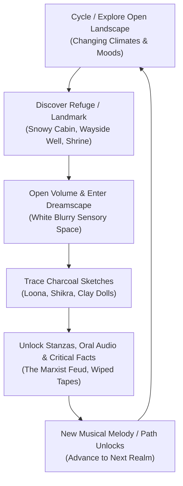

# GAME DESIGN DOCUMENT: BIRHA (ਬਿਰਹਾ)
### *A Contemplative Cycling Odyssey Through the Poetry of Shiv Kumar Batalvi*
*Visual & Gameplay Reference: **Season: A letter to the future***

---

## 1. Executive Summary & Vision Statement

**BIRHA** is a serene, solitary, low-poly exploration game set in a painterly, poetic recreation of mid-20th-century Punjab and the Himalayan foothills. 

You play as an unnamed traveler mounted on a vintage steel roadster bicycle, equipped with a mechanical bell, a field microphone, and a blank parchment journal. Riding across rolling grassy knolls at golden dawn, through monsoon-drenched riverbanks, and up into the freezing snow-clad ridges of Himachal, your journey is not to save the world, but to **record a vanishing soul before it turns to smoke**.

Throughout these vast landscapes, you seek shelter in lonely outposts—abandoned brick tea-stalls, wayside banyan shrines, and weather-beaten timber cabins. Inside a barely warm cabin on a cold snowy night, you discover worn, leather-bound volumes of poetry. Opening a book dissolves the physical world into an **ethereal, all-white blurry dreamscape**, where tracing charcoal contours of key figures (the wounded hawk, Loona in chains, dough sparrows) brings stanzas into focus, unlocking connected poems, oral voice fragments, and declassified historical facts regarding Shiv's life, his rebellion, and the fierce ideological war waged against him by Marxist critics.

---

## 2. Art Direction & Visual Identity (*Season* Reference)

### A. The "Season" Visual Aesthetic
* **Painterly Cel-Shaded Low-Poly**: Clean, soft polygonal geometry with rich watercolor wash textures. No jagged noise or cluttered realistic foliage; instead, sweeping plains of tall wild grass that bend dynamically with the mountain wind.
* **Atmospheric Lighting & Climates**:
  1. *The Pale Dawn*: Soft amber-gold sun rising over dewy green hills, casting long gentle shadows. Morning mist clinging to valleys.
  2. *The Monsoon Twilight*: Overcast silver clouds, gentle rain tapping against the bicycle handlebars, glistening slate roads, and rushing mud-brown riverwaters.
  3. *The Cold Blizzard Night*: Whistling wind, falling snowflakes, and a warm amber glow spilling through the frosted square window of a solitary wooden cabin.
  4. *The Deep Violet Sunset*: Crimson and indigo twilight stretching over the dry stone canyons of Sialkot.
* **Minimalist HUD**: No speedometers, health bars, or mini-maps. The screen is pure landscape. Navigation is guided by distant landmarks: a lone chimney smoking on a ridge, a banyan tree with fluttering saffron flags, or the distant song of a flute.

### B. The Shadowy Sketchy Silhouettes
* Across the vast hills and mountain peaks, the player will **rarely encounter human silhouettes**.
* These are not aggressive NPCs or dialogue vendors. They are **shadowy, charcoal-sketch humanoid figures** seen at a distance:
  - Sitting on an exposed cliff edge with knees drawn to their chest, gazing into the mist.
  - Slowly walking along a faraway ridge against the setting sun.
  - Lying down in the tall wild grass beneath a solitary blooming acacia tree.
* When approached, they do not speak. Instead, an ambient audio phenomenon occurs: the wind carries the faint, soaring *tarannum* (melodic recitation) of Shiv's voice or a mournful sarangi note, and a scrap of paper (a cigarette foil note) flutters onto the path for the player to collect.

---

## 3. Core Gameplay Loop & Mechanics

### 1. The Solitary Bicycle (Weighted Movement)
* **Pacing**: Deliberate, grounded, and meditative. You feel the effort of pedaling up grassy inclines and the effortless joy of freewheeling down gentle slopes with wind in your ears.
* **Controls**:
  - `Pedal / Coast`: Smooth analog acceleration with realistic bicycle inertia.
  - `Bicycle Bell`: Ringing the bell creates a clear, echoing metallic chime that causes nearby birds to scatter into the sky and reveals subtle acoustic echoes in foggy valleys.
  - `Dismount & Walk`: At any time, you can step off the bicycle, push it along a rocky foot trail, or leave it propped against a roadside milestone.

### 2. The Cold Cabin & The White Blurry Dreamscape
* While riding across the freezing mountain ridge at night, the temperature drops and a blizzard sets in. The player spots light emanating from an old, barely warm timber cabin.
* Stepping inside:
  - The howling wind is muffled. The crackle of an earthen hearth and the ticking of an old brass clock provide comforting warmth.
  - On a rustic wooden table rests a worn, handwritten volume—one of Shiv's canonical works (e.g. *Loona*, *Birha Tu Sultan*, *Piran da Paraga*).
* **The Dreamscape Transition**:
  - Turning the first page triggers a soft audio swell. The wooden walls and hearth gently dissolve into an **all-white, blurred dreamspace** (overexposed silver and soft vapor).
  - In this meditative canvas, the player uses their cursor/pen to trace faint charcoal contours.

### 3. The Charcoal Tracing Mechanic
* Tracing is not a rigid minigame; it is an act of tactile revelation:
  - Moving the charcoal stick across the blurred white paper reveals strokes of dark charcoal dust.
  - **In *Loona***: You trace the silhouette of young Loona standing before the royal throne, stripping off her heavy gold necklace. As the outline connects, the famous verse fades into the paper:
    > *"Pita je putt di sej te baithe / Jag usnu na denda daush / Par putt je maa de naina chumbhe / Dharat aakaash hilaunde krodh..."*
  - **In *Shikra Yaar***: You trace the crested falcon sitting upon a gaunt, bleeding wrist.
  - **In *Aate Dian Chiriyean***: You trace delicate dough birds melting in rainwater.
* **Unlocking Progression**:
  - Completing a sketch permanently records the full multi-script poem in your journal.
  - The sketch reveals a historical memory node: an archival audio recording of Shiv or a critical fact about his life.

---

## 4. Narrative Progression & The 5 Emotional Realms

The game world is structured into **5 contiguous open realms**, each hosting a distinct chapter of his artistic journey:

### Realm 1: The Dawn Hills of Batala (Innocence & Soil)
* **Climate**: Serene golden sunrise, dew-soaked emerald grass, morning cuckoos.
* **Key Poems**: *Bhatthi Waliye*, *Kee Puchhde O Haal*, *Pind Di Kudi*, *Lajwanti*.
* **Historical Unlocks**: 
  - His childhood in Bara Pind Lohtian (now Pakistan).
  - The visceral shock of the 1947 Partition flight across the river Ravi.
  - The father's fury when Shiv refused to work as a patwari (land revenue clerk), preferring to wander barefoot in the fields.

### Realm 2: The Silted Chenab & The Village Trinjan
* **Climate**: Overcast monsoon sky, silver river currents, spinning wheel circles.
* **Key Poems**: *Aate Dian Chiriyean*, *Kasumbi Rang*, *Mitti Da Bawa*, *Kach De Kangna*.
* **Historical Unlocks**:
  - The agrarian metaphors of Punjabi village life: clay kilns (*bhatthi*), unbaked pitchers (*kachha ghada*), and spinning assemblies (*trinjan*).
  - The influence of Waris Shah and Bulleh Shah on his melodic meters.

### Realm 3: The Cold Ridge Cabin & The Hegemony of the Red Flag
* **Climate**: Heavy snow falling on pine needles, twilight blue turning to starry night.
* **Key Poems**: *Main Ik Shikra Yaar Banaya*, *Ikk Kudi*, *Maye Ni Maye*, *Joban Rutte Marna*.
* **The Historical Clashes (Leftist Critics)**:
  - As you explore this high mountain zone, you discover old copies of literary magazines like *Siarh* and *Preetlari*.
  - You unlock the documented debates with **Sant Singh Sekhon** and **Paash**:
    - *Why did the Marxist establishment brand his grief as "reactionary escapism"?*
    - *Why did they accuse him of being "poison for the youth"?*
  - Uncover Shiv's iconic defense at the Chandigarh Coffee House: *"They command me to write about the redness of the flag; I can only write about the redness of the wound."*

### Realm 4: The Dark Cliffs of Sialkot (The Loona Heresy)
* **Climate**: Stormy twilight, lightning illuminating ancient stone ramparts, dry wells.
* **Key Poems**: *Loona (Acts I through VI)*.
* **The Sketches**:
  - Tracing Loona’s trial reveals the feminist revolution of 1965: transforming a reviled "evil stepmother" into Punjab’s first modern rebel against feudal patriarchy.
  - Winning the Sahitya Akademi Award at 31 as the youngest laureate, and the resulting jealousy from older academics.

### Realm 5: The Crossroad of the Void & Kir Mangyal (The Lost Spools)
* **Climate**: Cold misty dawn over railway tracks, falling yellow leaves, stillness.
* **Key Poems**: *Main Te Main*, *Aarti*, *Alvida*, *Kir Mangyal Di Bhor*.
* **The Final Investigation**:
  - Investigating the myth of the "burned diaries": finding the charred remnants of room clearances in Chandigarh where landlords tossed out boxes of drafts written on Gold Flake packets.
  - The tragic erasure of Akashvani and Doordarshan broadcast tapes due to magnetic tape shortages.
  - The final pilgrimage to his in-laws' village of Kir Mangyal where he passed away at 36 on May 7, 1973.

---

## 5. Audio Design & Sonic Atmosphere

Sound is the emotional soul of *BIRHA*:
* **Bicycle Foley**: The rhythmic, tactile click-click-click of the freewheel hub; tires humming against wet gravel; the crisp ping of the handlebar bell.
* **Environmental Ambiance**: Wind rustling through mustard crops, distant mourning doves (*ghuggi*), the crackle of pine wood on fire, rain dripping from cabin eaves.
* **Music & Vocals**: 
  - Sparse, meditative solo instruments: a solitary acoustic guitar, an ambient bowed esraj, and low drone harmoniums.
  - Archival vocal stems of Shiv Kumar Batalvi singing in his piercing, natural *tarannum*, floating across the mountains like a radio transmission from a lost world.

---

## 6. Technical Stack for Prototype

* **Engine**: React 18 + Three.js / React Three Fiber + Tailwind CSS (or WebGL canvas)
* **Data Core**: Sourced directly from `PARSED_CORPUS_MAPPING.json` containing all 211 categorized poems and academic citations.
* **Location**: Fully isolated in `season_game/` directory within workspace.
